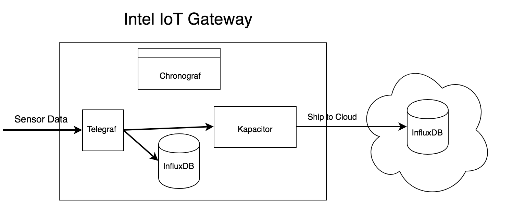

# Intel // InfluxData

This repo contains configuration and an installation script for the Intel IoT Gateway. It downloads the latest version of InfluxDB, Kapacitor, Chronograf and Telegraf from our repositories and installs and configures them. To install, just clone down this repo:

```
$ git clone git@github.com:influxdata/intel-influxdata.git && cd intel-influxdata
$ sudo ./install_tick.sh
```

Once the script runs, Chronograf will be available at localhost:8888. Use the UI to configure connections to InfluxDB (`http://localhost:8086`) and Kapacitor (`http://localhost:9092`). If you would like to ship metrics to a cloud instance of InfluxDB as well as storing locally, edit the `[[influxdb]]name = "cloudInflux"` in the `kapacitor.conf` file to contain the proper credentials and enable the output. :star:s mark fields that need to be changed.:

```
# This is sample configuration for shipping metrics with Kapacitor
# Set enabled = true, set your remote influxdb url, connection paramaters
# and define and enable the tickscript in this folder to enable shipping 
[[influxdb]]
  enabled = false
  default = false
  name = "cloudInflux" 
  urls = ["https://my-influx-cloud.influxcloud.net:8086"] :star:
  username = "myInfluxCloudUsername" :star:
  password = "myInfluxCloudPassword" :star:
  timeout = 0
  insecure-skip-verify = false
  startup-timeout = "5m"
  disable-subscriptions = true
  subscription-protocol = "http"
  subscriptions-sync-interval = "1m0s"
  kapacitor-hostname = ""
  http-port = 0
  udp-bind = ""
  udp-buffer = 1000
  udp-read-buffer = 0
  [influxdb.subscriptions]
  [influxdb.excluded-subscriptions]
```

Then define and enable the `toCloud.tick` tickscript for all `dbrp` combinations you would like to ship to your cloud instance:

```
$ kapacitor define shipToCloud -dbrp telegraf.autogen -dbrp mydb.myrp -tick toCloud.tick -type stream
$ kapacitor enable shipToCloud
```


